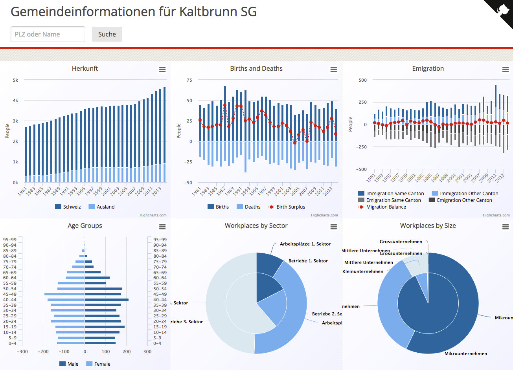

# Open Data Statistics about Swiss Communities [](https://travis-ci.org/lukasmartinelli/gemeindedb)

The goal of the project is to collect statistics about swiss communities in one places.
Most of the data is from the [BFS](http://www.bfs.admin.ch/) and is transformed
to TSV files.  The TSV format makes it easy to get started with the data and doing some real work with it
instead of looking through XLSX or PX files.

The project also contains a ETL process to transform the data into a relational schema with PostgreSQL.



## Statistical Data

The collected data files are in the folder `data`.
You are free to use the TSV files in `data` for your own purposes.

## Import

Using [my PostgreSQL import tool pgfutter](https://github.com/lukasmartinelli/pgfutter) the TSV files
are automatically imported into the PostgreSQL database.

To run a import into the `postgres` container you first need to start the database container.

```
docker-compose up -d postgres
```

And then run the import of the data.

```
docker-compose run import
```

From the import tables a new relational schema is created where it is easier to work with the data.

```
docker-compose run schema
```

## Find Wikipedia Links for Data

```bash
cat communities_zip_search_data.tsv \
    | sed 1d \
    | python find_wikipedia_data.py \
    | tee gemeinden_wikipedia_2015.tsv
```

## Data Sources

| File                                   | Source                                                                                                                                         |
|----------------------------------------|------------------------------------------------------------------------------------------------------------------------------------------------|
| politische_gemeinden_2015.tsv          | STATATLAS Institutionelle Gliederungen > Politische Gemeinden 2015                                                                             |
| kantone_1997.tsv                       | STATATLAS Institutionelle Gliederungen > Kantone 1997                                                                                          |
| mittlere_wohnbevölkerung_1981_2014.tsv | STAT-TAB Gemeindestatistik1981-2014 nach demographischen Komponenten, institutionellen Gliederungen, Staatsangehörigkeit, Geschlecht und Jahr  |
